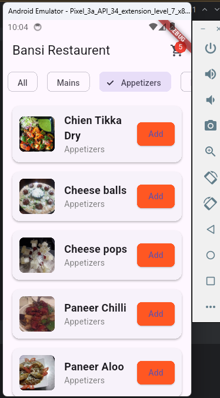
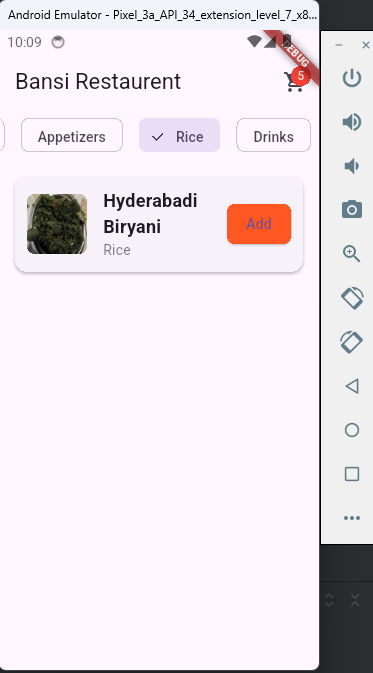
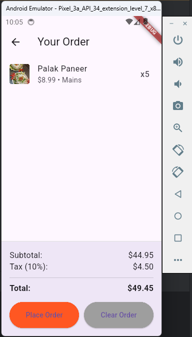

# flutter_restaurant_app
# Bansi Restaurant - Flutter Menu App

A Flutter application for browsing restaurant menu items, adding them to cart, and placing orders.

## Features

- Browse menu items by category
- Add/remove items from cart
- Order summary with tax calculation
- Responsive UI for all screen sizes
- Visual category filtering

## Installation

### Prerequisites

- Flutter SDK (latest stable version)
- Dart SDK
- Android Studio/VSCode with Flutter plugin
- Android/iOS emulator or physical device

### Setup

1. Clone the repository:
```bash
git clone https://github.com/YuvrajPatel23/flutter_restaurant_app.git
cd bansi-restaurant
```

2. Install dependencies:
```bash
flutter pub get
```

3. Run the app:
```bash
flutter run
```

## Project Structure

```
lib/
├── main.dart                # App entry point
assets/
├── images/                  # Menu item images
```

## Configuration

Add your images to `assets/images/` and update `pubspec.yaml`:

```yaml
flutter:
  assets:
    - assets/images/
```

## Screenshots

| Home Screen | Category Filter | Cart Screen |
|-------------|-----------------|-------------|
|  |  |  |
## Dependencies

This app uses only Flutter core packages with no external dependencies.


## License

This project is licensed under the MIT License.